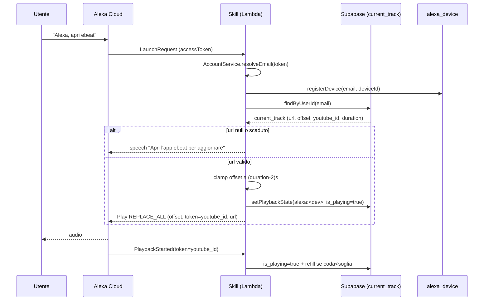
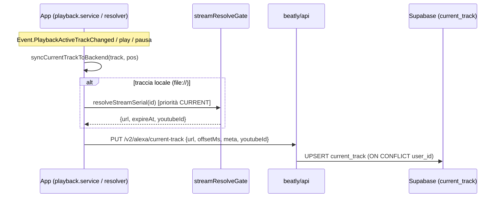
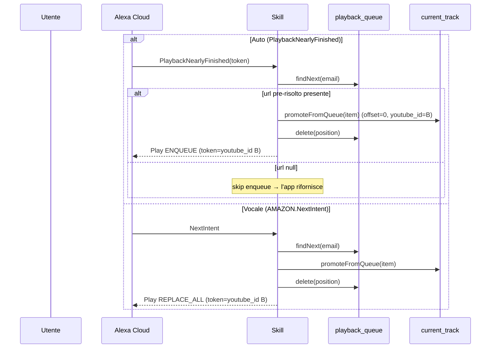
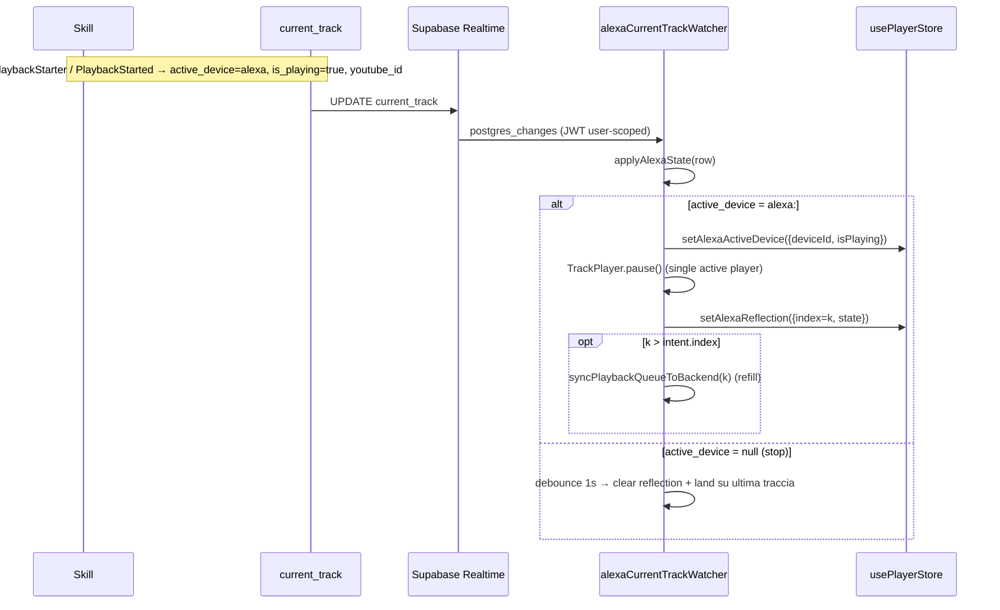
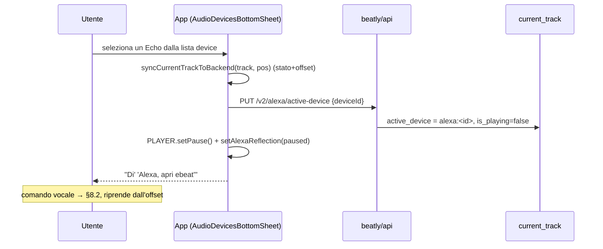
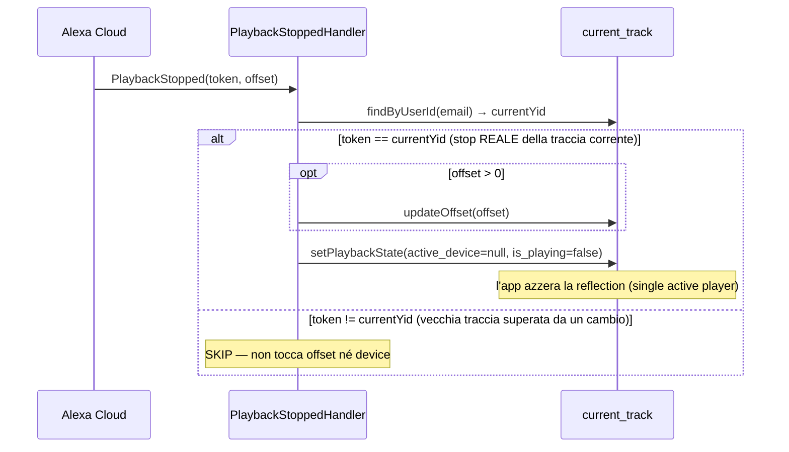
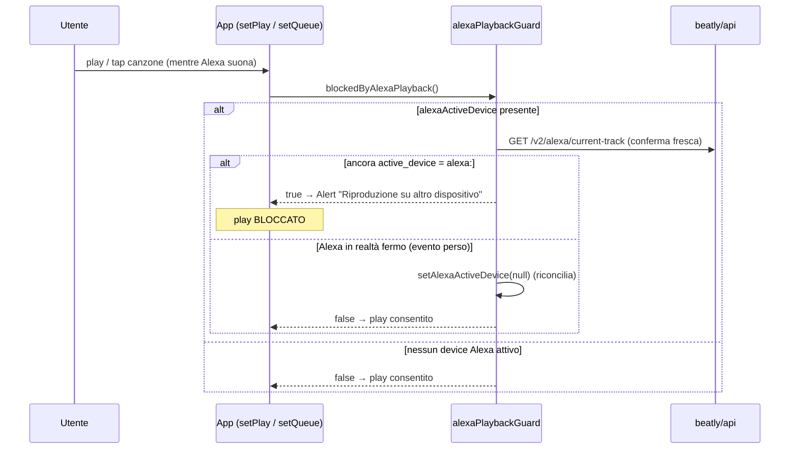
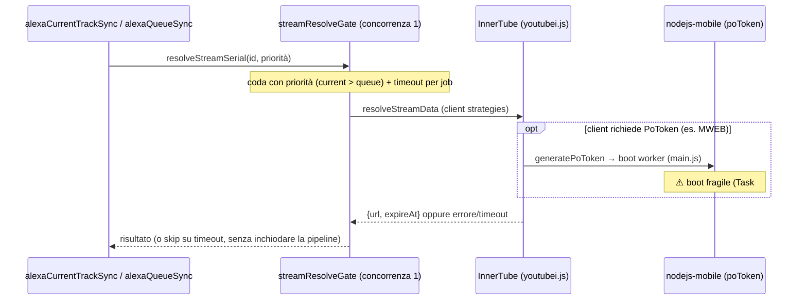

# Specifica Tecnica — Integrazione Alexa ⇄ beatly

> Documento di analisi tecnica dell'integrazione tra la **skill Alexa "ebeat"**,
> il backend **beatly/api**, l'**app mobile beatly** e **Supabase**.
> Versione: branch `merge/alexa-skill` (integrazione con `development`).
> Ultimo aggiornamento: 2026-07-07.

---

## Indice

1. [Scopo e ambito](#1-scopo-e-ambito)
2. [Glossario e componenti](#2-glossario-e-componenti)
3. [Architettura](#3-architettura)
4. [Vincoli di progetto](#4-vincoli-di-progetto)
5. [Modello dati (Supabase)](#5-modello-dati-supabase)
6. [Sicurezza](#6-sicurezza)
7. [Casi d'uso](#7-casi-duso)
8. [Flussi e diagrammi di sequenza](#8-flussi-e-diagrammi-di-sequenza)
9. [Componenti: dettaglio implementativo](#9-componenti-dettaglio-implementativo)
10. [Problemi noti e debito tecnico](#10-problemi-noti-e-debito-tecnico)
11. [Passi per la produzione](#11-passi-per-la-produzione)
12. [Appendice: matrice env / segreti](#12-appendice-matrice-env--segreti)

---

## 1. Scopo e ambito

L'integrazione consente all'utente di **spostare l'ascolto tra l'app mobile e un
dispositivo Alexa (Echo)** mantenendo lo stato di riproduzione (traccia corrente,
offset, coda) coerente tra i due mondi, con la regola **single active player**
(un solo dispositivo suona alla volta).

I tre runtime **non comunicano direttamente**: l'unico canale condiviso è
**Supabase** (tabelle + Realtime). La skill Alexa e il BE non chiamano mai
YouTube (vincolo IP, §4); solo l'app risolve gli stream.

---

## 2. Glossario e componenti

| Componente | Runtime | Ruolo |
|---|---|---|
| **Skill "ebeat"** | AWS Lambda (Java 21, ASK SDK) | Handler delle richieste Alexa (Launch, Intent, AudioPlayer events). Legge/scrive Supabase via REST con service-role key. |
| **beatly/api (BE)** | Node.js (Express, MikroORM) | Account-linking OAuth per Alexa; endpoint `/v2/alexa/*` per l'app (scrivono Supabase bypassando RLS); conia JWT Realtime per l'app. |
| **App beatly** | React Native / Expo | Player locale (InnerTube/youtubei.js). Rispecchia lo stato Alexa (reflection), alimenta `current_track`/`playback_queue`, impone la mutua esclusione. |
| **Supabase** | Postgres + PostgREST + Realtime | Stato condiviso: `current_track`, `playback_queue`, `alexa_device`. RLS + publication Realtime. |
| **Alexa Cloud** | Amazon | Instrada voce/eventi AudioPlayer alla Lambda; gestisce l'account linking. |

**Identità utente**: tutte le tabelle Alexa sono **chiavizzate per email**
(`user_id = email`). È l'identità che la skill risolve dal token di
account-linking e che il BE usa (`req.user.email`).

---

## 3. Architettura

```
                          OAuth account-linking
   ┌───────────┐   (voce/eventi)   ┌──────────────────┐    (ngrok/https)
   │  Utente   │◀────────────────▶│   Alexa Cloud    │────────────────┐
   └───────────┘                   └───────┬──────────┘                │
        │ app                              │ invoke                    ▼
        ▼                                  ▼                    ┌──────────────┐
   ┌───────────┐   HTTPS /v2/alexa/*  ┌──────────┐   REST      │  beatly/api  │
   │   App     │────────────────────▶│  (BE)    │  (svc key)   │   (Node)     │
   │  beatly   │◀── Realtime (JWT) ───┤          │             └──────┬───────┘
   └─────┬─────┘                      └────┬─────┘                    │
         │ REST diretto (InnerTube)        │ SQL diretto              │ REST admin/db
         ▼                                 ▼                          ▼
   ┌───────────┐                    ┌───────────────────────────────────────┐
   │  YouTube  │                    │              Supabase                  │
   │ (InnerTube)│                   │  current_track · playback_queue ·      │
   └───────────┘                    │  alexa_device  (RLS + Realtime)        │
                                    └───────────────────────────────────────┘
        ▲                                              ▲
        │ REST diretto (service-role key)              │
   ┌────┴───────────┐                                  │
   │ Skill (Lambda) │──────────────────────────────────┘
   └────────────────┘
```

Punti chiave:
- **Skill → Supabase**: REST diretto con **service-role key** (bypassa RLS).
- **App → Supabase (scrittura)**: solo tramite **BE** (`/v2/alexa/*`), che scrive
  con SQL diretto/anon privilegiato — l'app non ha permessi di scrittura diretta.
- **App → Supabase (lettura live)**: **Realtime** su `current_track`, autenticato
  con un **JWT `authenticated`** coniato dal BE (`/v2/alexa/realtime-token`),
  soggetto a RLS user-scoped.
- **App → YouTube**: **solo l'app** risolve gli stream (IP residenziale).

---

## 4. Vincoli di progetto

1. **No storage di bytes audio.** Solo URL stream "live" (googlevideo/HLS) +
   metadati. Nessun download su disco/bucket/DB.
2. **No chiamate YouTube da BE/Skill.** BE e Lambda girano su IP datacenter →
   rate-limiting + bot-detection YouTube (429, "Sign in to confirm you're not a
   bot"). Solo l'app (IP residenziale) risolve gli stream. Gli endpoint legacy
   `/refresh-track`, `/resolve-youtube-id`, `/refill-queue` sono **410 Gone**.
3. **Single active player.** App e Alexa non suonano contemporaneamente.
4. **App usa YouTube/InnerTube** (non Deezer, legacy in deprecazione).
5. **Schema canonico in `ebeat_skill.sql`** (idempotente, ri-eseguibile).

---

## 5. Modello dati (Supabase)

### 5.1 `current_track` (una riga per utente, UPSERT su `user_id`)

| Campo | Tipo | Note |
|---|---|---|
| `user_id` | TEXT (unique) | Email utente |
| `url`, `url_expires_at` | TEXT, TIMESTAMPTZ | Stream corrente + scadenza |
| `offset` | BIGINT | Posizione in **ms** |
| `track_id` | BIGINT | ID Deezer (canonico) |
| `track_title`, `track_artist` | TEXT | Metadati |
| `track_duration` | BIGINT | **secondi** (usato per clamp offset) |
| `youtube_id` | TEXT | ID video (anche **token** delle directive, §8.7) |
| `loop_mode` | BOOLEAN | Caso 9 |
| `active_device` | TEXT | `alexa:<deviceId>` / `app:<id>` / `null` |
| `is_playing` | BOOLEAN | true solo mentre suona |
| `playback_state_changed_at` | TIMESTAMPTZ | Ultimo cambio stato |
| `radio_seed_track_id` | BIGINT | Seed radio (caso 15) |
| `updated_at` | TIMESTAMPTZ | |

### 5.2 `playback_queue` (PK `(user_id, position)`)

`position=1` è la prossima traccia dopo `current_track`. Campi: `youtube_id`,
`url`, `url_expires_at`, `track_id`, `track_title`, `track_artist`,
`track_duration`, `added_at`. Indice secondario su `user_id`.

### 5.3 `alexa_device` (PK `(user_id, device_id)`)

Registry dei device Echo dell'utente: `name`, `created_at`, `last_seen_at`.
Popolato dalla skill ad ogni riproduzione (`registerDevice`), letto dall'app per
il menù "dispositivi".

### 5.4 RLS & Realtime

- **RLS attiva** su `current_track`, `playback_queue`, `alexa_device`.
- Policy `current_track_read` — `FOR SELECT TO authenticated USING (user_id = auth.jwt() ->> 'email')`.
- La **skill** usa la **service-role key** → bypassa RLS.
- L'**app** legge in Realtime con JWT `authenticated` (email nel claim) → vede
  solo la propria riga.
- **Publication** `supabase_realtime` include `current_track` e `playback_queue`.

---

## 6. Sicurezza

- **`SUPABASE_SERVICE_KEY` resta server-side** (skill Lambda + BE). Mai nell'app.
- **App** non scrive direttamente Supabase: passa dal BE (autenticato con la sua
  sessione utente). Il BE chiavizza sempre per `req.user.email` (mai
  `req.user.sub`), per allinearsi alla skill.
- **JWT Realtime** coniato dal BE con `SUPABASE_JWT_SECRET` (HS256, `role=authenticated`,
  `email` nel claim), TTL 1h, refresh lato app prima della scadenza.
- **Account linking OAuth**: `ALEXA_OAUTH_CLIENT_ID/SECRET` validati dal BE su
  `/alexa/oauth/token` (HTTP Basic); CSP con `form-action` verso i domini Amazon.
- **Certificati** (Google SA, Apple Signin, ECDSA app-config) montati come file
  in `.certs/<secret>/<name>.<ext>` (modello Secret Manager, §11).

---

## 7. Casi d'uso

| # | Caso | Stato |
|---|---|---|
| 1 | Avvio skill da comando vocale (auto-play) | Fatto |
| 2 | Stop della skill | Fatto |
| 3 | Avvio ultima traccia attiva | Fatto |
| 4 | Avvio dopo scadenza URL | App-side (skill non risolve) |
| 5 | Stop / Pausa / Ripresa | Fatto |
| 6 | Sync app → Supabase (`current_track`) | Fatto (app) |
| 7 | Passaggio alla prossima (coda) | Fatto |
| 8 | Riavvio traccia da capo | Fatto |
| 9 | Loop | Fatto |
| 10 | Cambio traccia dall'app | Parziale |
| 11 | Play/Pause/Stop app → Alexa | Parziale |
| 12 | **Mutua esclusione device (single active player)** | Fatto |
| 13 | Trasferimento app → Alexa (handover) | Livello A (fatto) |
| 14 | Sync live durante riproduzione Alexa | Workaround / reflection |
| 15 | Ricerca vocale (Deezer + YouTube) | **Disabilitato** (vincolo IP) |
| — | **Reflection Alexa → app** (mini + full player) | Fatto |
| — | **Auto-refill coda su avanzamento** | Fatto |

---

## 8. Flussi e diagrammi di sequenza

### 8.1 Account linking (OAuth)

```mermaid
sequenceDiagram
    participant U as Utente
    participant AA as App Alexa
    participant AC as Alexa Cloud
    participant BE as beatly/api
    participant SB as Supabase Auth
    U->>AA: Abilita skill → "Collega account"
    AA->>BE: GET /alexa/oauth/authorize
    BE->>U: WebView login (OTP via Supabase)
    U->>BE: credenziali
    BE->>SB: verifica utente
    SB-->>BE: ok (email)
    BE-->>AC: redirect con authorization code
    AC->>BE: POST /alexa/oauth/token (HTTP Basic client_id/secret)
    BE-->>AC: access_token (bound all'utente)
    Note over AC: access_token salvato; incluso in ogni richiesta skill
```

### 8.2 Avvio riproduzione (Launch / MusicPlayIntent) — casi 1/3



### 8.3 Sync app → Supabase (caso 6)



### 8.4 Passaggio alla prossima traccia (caso 7)

**Auto (fine traccia)** e **vocale ("Alexa, prossima")**:



### 8.5 Reflection Alexa → App



L'app in background sospende il websocket Realtime: al ritorno in foreground
`checkAlexaStateNow()` rilegge `current_track` dal BE (`GET /current-track`) e
ri-applica lo stato (recupero eventi persi).

### 8.6 Handover App → Alexa (caso 13, livello A)



### 8.7 Stop / cambio traccia — token = youtube_id (race-immunity)

Problema: "Alexa stop" sull'audio in background arriva come **`PlaybackStopped`**
(non `StopIntent`). E sul cambio traccia (`REPLACE_ALL`) `PlaybackStopped(vecchia)`
e `PlaybackStarted(nuova)` sono invocazioni Lambda separate → **race** sulle
scritture. Soluzione: il **token** delle directive Play è lo **`youtube_id`**;
`PlaybackStoppedHandler` confronta il token con `current_track.youtube_id`.



Corollario **"stop → atterra su B"**: quando la reflection si azzera, l'app
sposta il player locale sulla traccia che `current_track` indica (il suo
`youtube_id` sopravvive allo stop) con `setIntent(..., playWhenReady:false)` —
non torna alla traccia pre-handover.

### 8.8 Mutua esclusione — single active player (caso 12)



Simmetrico: quando Alexa parte, `applyAlexaState` chiama `TrackPlayer.pause()`
locale. Per riprendere sull'app **si ferma prima Alexa** ("Alexa, stop").

### 8.9 Risoluzione stream & poToken (gate seriale)



---

## 9. Componenti: dettaglio implementativo

### 9.1 Skill (Lambda, `lambda/custom`)

- **`PlaybackStarter`** — logica condivisa "risolvi utente → leggi traccia →
  clamp offset → emetti Play". Token directive = `youtube_id`. Scrive
  `active_device=alexa`, `is_playing=true`.
- **`PlaybackStartedHandler`** — su ogni start: `is_playing=true` + riafferma
  `active_device`; auto-refill radio se coda sotto soglia.
- **`PlaybackStoppedHandler`** — §8.7: rilascio device condizionato al token.
- **`NextIntentHandler` / `PlaybackNearlyFinishedHandler`** — §8.4; token=youtube_id.
- **`CancelAndStopIntentHandler`** — stop vocale a sessione aperta: loop off +
  rilascio device.
- **`CurrentTrackService` / `PlaybackQueueService` / `DeviceService`** — accesso
  PostgREST (service key). `SupabaseRestClient` factory con header service-role.
- **`AccountService`** — token → email via API admin Supabase.

### 9.2 BE (`beatly/api`, `/v2/alexa/*`)

| Metodo | Endpoint | Funzione |
|---|---|---|
| PUT | `/current-track` | UPSERT stato now-playing (caso 6) |
| GET | `/current-track` | Snapshot per il check reflection allo startup/foreground |
| PUT | `/active-device` | Claim/release device (handover) |
| PUT | `/queue` | **Replace atomico** della coda (CTE: DELETE tail + INSERT … ON CONFLICT) |
| GET | `/realtime-token` | Conia JWT `authenticated` per Realtime |
| GET/PATCH/DELETE | `/devices[...]` | Registry device per il menù app |

Repo `AlexaDevice.repository` scrive con SQL diretto (bypassa PostgREST/RLS,
quota `"offset"`). `replacePlaybackQueue` è **atomico** (una sola istruzione).

### 9.3 App (`beatly/app/src`)

- **`services/alexaCurrentTrackSync.ts`** — mirror now-playing → `current_track`;
  risolve stream remoto per tracce locali (via gate, priorità CURRENT).
- **`services/alexaQueueSync.ts`** — riempie `playback_queue`; single-flight +
  coalescing, risoluzione **seriale** testa-per-prima (PUT-early), dedup per
  firma; `startPlaybackQueueWatcher` risincronizza sui cambi di `queue`
  (autoplay/radio).
- **`services/alexaCurrentTrackWatcher.ts`** — subscribe Realtime + re-check
  foreground; `applyAlexaState` (reflection, activeDevice, pausa-locale su Alexa,
  clear debounced, land-on-stop).
- **`services/streamResolveGate.ts`** — gate globale concorrenza 1, **priorità**
  (current > queue) + **timeout** per job (anti-inchiodamento poToken).
- **`services/alexaPlaybackGuard.ts`** — `isAlexaExclusivelyPlaying` (rilettura
  fresca) + `blockedByAlexaPlayback` (Alert centrato).
- **`stores/usePlayerStore.tsx`** — campi `alexaReflection { index, state }`,
  `alexaActiveDevice { deviceId, isPlaying }` (non persistiti).
- **Hook player** — `player.resolver` (sync su commit), `player.controls.setPlay`
  e `player.queue.setQueue` (blocco mutua esclusione).
- **UI reflection** — mini-player (`MusicBarPlayer` + `CustomTabBar`) e full
  player (`routes/(app)/player`): badge "In riproduzione su Alexa", artwork
  statico, override play/pausa, slider disabilitato.

---

## 10. Problemi noti e debito tecnico

- **Task #1 — crash boot nodejs-mobile poToken.** Quando la risoluzione ripiega
  su un client che richiede PoToken (es. MWEB su video rimossi), il boot del
  worker `nodejs-mobile` (`poTokenBridge`) può crashare/inchiodare l'app. Il gate
  seriale + timeout **contengono i danni** (niente burst, niente blocco a
  cascata) ma non la causa radice. Opzioni: (a) escludere i client PoToken dalla
  risoluzione batch della coda; (b) runner BotGuard su WebView; (c) provider
  PoToken alternativo. **La generazione PoToken deve restare lato app** (IP
  residenziale).
- **Caso 12/13/14 livello B (Proactive Events).** Lo stop "app → Alexa" live e il
  trasferimento automatico richiedono SMAPI + Proactive Events: non implementati.
  Copertura attuale asimmetrica (Alexa→app via Realtime; app→Alexa richiede stop
  vocale).
- **Caso 15 (ricerca vocale) disabilitato** per il vincolo IP. Re-design futuro
  via Realtime (app risolve, skill polla).
- **Deezer** legacy in deprecazione.
- **Latenza reflection**: le scritture skill sono ottimizzate per identità
  (token=youtube_id) ma restano soggette alla latenza Realtime (~sub-secondo).

---

## 11. Passi per la produzione

> Ordine consigliato: **Supabase → BE → Skill → Alexa Console → App**.

### 11.1 Supabase (schema)

1. Eseguire `ebeat_skill.sql` nel SQL editor del progetto **di produzione**
   (idempotente): crea/aggiorna `current_track`, `playback_queue`,
   `alexa_device`, RLS, policy user-scoped, publication Realtime.
2. Verificare in **Database → Replication** che `current_track` e
   `playback_queue` siano nella publication `supabase_realtime`.
3. Verificare le **policy RLS** (`current_track_read` su `authenticated`).

### 11.2 Backend (beatly/api)

1. **Segreti/env** (vedi §12). In particolare:
   - `REFRESH_TOKEN_ENCRYPTION_KEYS` (hex 32B, ≥1 chiave) — **obbligatoria**,
     altrimenti il bootstrap fallisce (`AesGcmKeyring requires at least one key`).
   - `OAUTH_TOKEN_ENCRYPTION_KEY`, `INVITE_TOKEN_ENCRYPTION_KEY`.
   - `SUPABASE_JWT_SECRET` (per il minting Realtime), `SUPABASE_*`.
   - `ALEXA_OAUTH_CLIENT_ID/SECRET`, `ALEXA_SKILL_ID`.
2. **Certificati** montati come file nel layout a sottocartelle (Secret Manager):
   `.certs/google/GoogleServiceAccount.pk`, `.certs/apple/AppleSigninKey.pk`,
   `.certs/appconfig/AppConfigEcdsaPrivateKey.pem`, `.certs/db/supabase-db-ssl.crt`.
   La chiave ECDSA app-config **deve corrispondere** alla pubkey nell'app
   (`EXPO_PUBLIC_APP_CONFIG_ECDSA_PUBLIC_KEY_B64`).
3. **Redis** raggiungibile (rate-limit + cache fail-closed).
4. Deploy dietro **HTTPS pubblico** (per l'account linking Alexa). CSP con i
   domini Amazon già configurata (`/alexa/oauth`).
5. Smoke test: `GET /v2/alexa/current-track` (401 senza auth = ok), bootstrap log
   `Server is running` + `Certificates initialized successfully`.

### 11.3 Skill (Lambda, Java)

> **Novità (migrazione Redis, Fasi 1–4)**: dalla Fase 3 la skill **non accede
> più a Supabase per lo stato di riproduzione** — legge/scrive via gli endpoint
> interni del BE (`/v1/internal/alexa/*`). Conseguenza: la skill **dipende dal
> BE raggiungibile** dalla Lambda (SPOF). Se il BE è giù/mal configurato la skill
> **degrada con un messaggio vocale** (non crash): vedi `GenericExceptionHandler`
> (eventi AudioPlayer → risposta vuota/silenzio; richieste vocali → speech) e il
> wrap di `findByUserId` in `PlaybackStarter`. `AccountService.resolveEmail` resta
> su Supabase Auth admin (Fase 5 rinviata) → le due env `SUPABASE_*` servono ancora.

1. **Build del jar** con **JDK 21** (il pom targetta release 21):
   `build-skill.bat` (forza il JDK 21 se presente) → `target/ebeat-1.0.jar`
   (shaded, ~15 MB).
2. **Upload** su AWS Lambda della skill (handler `EbeatStreamHandler`).
3. **Env var Lambda**:
   - `SKILL_BE_INTERNAL_URL` — **obbligatoria**, base degli endpoint interni,
     es. `https://<host-prod>/v1/internal/alexa` (**con schema https**, path
     incluso). null/malformata → speech di fallback, niente crash.
   - `SKILL_BE_SECRET` — **obbligatoria**, bearer condiviso; **stesso valore**
     dell'env `SKILL_BE_SECRET` del BE (fail-closed lato BE).
   - `SUPABASE_DB_TRACK_URI` (es. `https://<ref>.supabase.co/rest/v1/current_track`)
     — usata **solo** da `AccountService.resolveEmail` (deriva la base Auth admin).
   - `SUPABASE_SERVICE_KEY` (**service-role**, server-side) — idem AccountService.
   - `BACKEND_REFRESH_URL` / `BACKEND_REFILL_URL` / `BACKEND_RESOLVE_URL` —
     **non usate** a runtime (casi deprecati/disabilitati): omettibili.
4. Permessi/timeout Lambda adeguati (cold start Java: memoria ≥ 512 MB, timeout ≥ 8 s).

### 11.4 Alexa Developer Console

1. **Endpoint**: ARN della Lambda.
2. **Account Linking**: Authorization URI `https://<host>/alexa/oauth/authorize`,
   Access Token URI `https://<host>/alexa/oauth/token`, `client_id/secret`
   coerenti con `ALEXA_OAUTH_*` del BE, scope, redirect (usa `ALEXA_SKILL_ID`).
3. **Interaction Model** (`models/it.json` + `models/en-US.json`, **bilingue
   IT + EN**): le risposte vocali sono localizzate via `util/I18n` in base al
   `locale` della richiesta (fallback italiano); i due modelli sono in parità di
   intent (invocation IT `riproduttore`, EN `ebeat player`). Intent: built-in
   `AMAZON.Pause/Resume/Next/Previous/StartOver/LoopOn/LoopOff/Repeat/ShuffleOn/
   ShuffleOff/Stop/Cancel/Help/Fallback/NavigateHome` + custom `MusicPlayIntent`,
   `SyncIntent`. Controlli AudioPlayer da pulsanti/card gestiti da
   `PlaybackControllerHandler`. La ricerca vocale (`PlayTrackIntent`, Yes/No —
   caso 15) è **rimossa dal modello** (scaffold Java conservato). Per aggiungere
   una lingua: nuovo `models/<locale>.json` + coppie in `I18n`.
4. **Interfacce**: abilitare **AudioPlayer**.
5. Distribuzione/certificazione secondo policy Amazon.

### 11.5 App (beatly)

1. **Build** dev/prod. Per la build locale riproducibile:
   `docker compose run --rm android bash ../docker/build-android.sh`
   (fa prebuild **nel container** — path Linux — e imposta l'heap Gradle a 6 GB).
   Per store/OTA: pipeline EAS del team.
2. **Env `EXPO_PUBLIC_*`** di produzione: `EXPO_PUBLIC_API_BASE_URL` (host BE prod),
   `EXPO_PUBLIC_SUPABASE_URL/ANON_KEY`, `EXPO_PUBLIC_APP_CONFIG_ECDSA_PUBLIC_KEY_B64`
   (coerente col BE), ecc.
3. Verifica: login → play → handover ad Alexa → reflection → stop → mutua
   esclusione (popup "Riproduzione su altro dispositivo").

### 11.6 Checklist go-live

- [ ] `ebeat_skill.sql` eseguito su Supabase prod (tabelle + RLS + Realtime).
- [ ] BE prod up, bootstrap ok, certs presenti, `REFRESH_TOKEN_ENCRYPTION_KEYS` set.
- [ ] Jar skill (JDK 21) caricato; env Lambda set; AudioPlayer abilitato.
- [ ] Account linking configurato e testato end-to-end.
- [ ] App prod punta al BE prod; ECDSA app-config allineata.
- [ ] Test: play, next (auto+vocale), stop, handover, reflection, single active player.
- [ ] Monitoraggio: CloudWatch (skill), log BE, eventuali crash poToken (Task #1).

---

## 12. Appendice: matrice env / segreti

| Chiave | Dove | Note |
|---|---|---|
| `SKILL_BE_INTERNAL_URL` | Skill | base `/v1/internal/alexa` del BE (https, path incluso) |
| `SKILL_BE_SECRET` | Skill, BE | bearer service-to-service; **stesso valore** sui due lati |
| `SUPABASE_SERVICE_KEY` | Skill, BE | service-role, **mai** nell'app; skill solo per `resolveEmail` |
| `SUPABASE_DB_TRACK_URI` | Skill | base Auth admin per `resolveEmail` (Fase 5 rinviata) |
| `ALEXA_STORE_BACKEND` | BE | `supabase` (default) \| `redis` (migrazione) |
| `SUPABASE_JWT_SECRET` | BE | minting JWT Realtime |
| `SUPABASE_URL` / `SUPABASE_ANON_KEY` | BE, App(`EXPO_PUBLIC_*`) | |
| `REFRESH_TOKEN_ENCRYPTION_KEYS` | BE | **obbligatoria** (hex 32B, ≥1) |
| `OAUTH_TOKEN_ENCRYPTION_KEY`, `INVITE_TOKEN_ENCRYPTION_KEY` | BE | |
| `ALEXA_OAUTH_CLIENT_ID/SECRET`, `ALEXA_SKILL_ID` | BE | account linking |
| `.certs/google|apple|appconfig|db/*` | BE (file) | layout a sottocartelle |
| `EXPO_PUBLIC_API_BASE_URL` | App | host BE |
| `EXPO_PUBLIC_APP_CONFIG_ECDSA_PUBLIC_KEY_B64` | App | deve combaciare col BE |

---

*Fine documento.*
