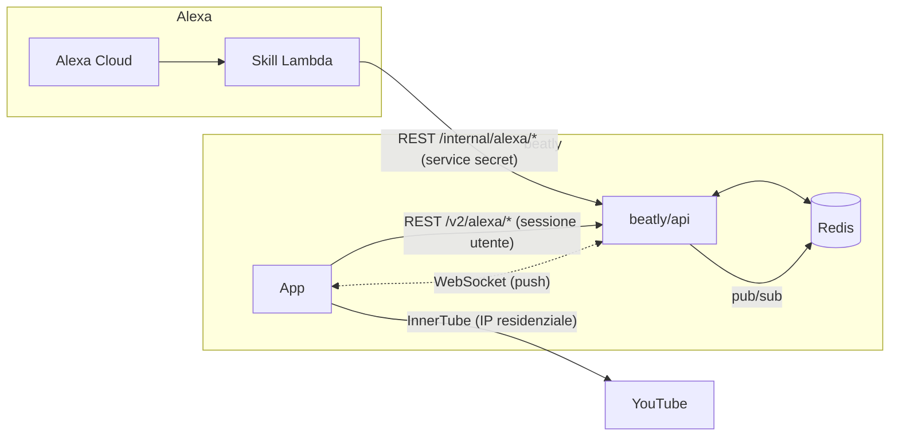

# Migrazione Alexa: da Supabase a Redis (BE-centrica)

> Design della migrazione dello stato di riproduzione Alexa (`current_track`,
> `playback_queue`, `alexa_device`) da **Supabase** a **Redis**, in vista della
> **dismissione di Supabase**.
> Branch: `feature/skill_alexa_redis` (beatly + ebeat_skill).
> Stato: **IN CORSO** — Fasi 1–4 implementate (BE + skill + app, branch
> `feature/skill_alexa_redis`). Retro-compatibili: flag BE default `supabase`.
> Skill e app parlano entrambe al BE; l'app riceve i realtime via SSE. Restano
> Fase 5 (resolveEmail via BE) e Fase 6 (cutover flag→redis + cleanup Supabase).

---

## 1. Obiettivo e vincoli

- **Rimuovere la dipendenza da Supabase** per lo stato di riproduzione Alexa.
- Lo stato è **effimero**: la perdita al riavvio del BE è **accettabile** (l'app
  lo ricostruisce). → Redis senza persistenza (o con TTL) va bene.
- Restano invariati i vincoli di prodotto: **no storage bytes audio**, **no
  chiamate YouTube da BE/skill** (solo l'app risolve), **single active player**.

---

## 2. Il problema: Supabase fa **tre** cose, non una

Oggi Supabase non è "solo un DB". Fornisce tre servizi che vanno sostituiti
**separatamente**:

| # | Servizio Supabase | Chi lo usa | Sostituto Redis/BE |
|---|---|---|---|
| A | **Storage** tabellare (`current_track`, `playback_queue`, `alexa_device`) | Skill (diretto), BE (per l'app) | **Redis** (via BE) |
| B | **Realtime** (push websocket con RLS) su `current_track` | App (reflection) | **WebSocket sul BE** + Redis Pub/Sub |
| C | **Auth map** token→email (`AccountService.resolveEmail` via admin API) | Skill | **Endpoint BE** (il token OAuth è già emesso dal BE) |

> ⚠️ Il punto critico è che oggi **la skill accede a Supabase DIRETTAMENTE**
> (service key), senza passare dal BE. Nella migrazione **la skill dovrà passare
> dal BE** → il BE diventa dipendenza runtime della skill. È un cambio di
> topologia, non solo di storage.

---

## 3. Architettura target



Principi:
- **Il BE è l'unico hub.** Skill e app parlano **solo col BE**.
- **Redis** è la store effimera (dietro il BE; non esposto a skill/app).
- Il **push live** all'app è un **WebSocket ospitato dal BE**; il fan-out tra
  istanze BE avviene via **Redis Pub/Sub**.
- La skill si autentica al BE con un **service secret** e passa l'**access_token
  Alexa** (emesso dal BE stesso) per la risoluzione utente.

---

## 4. Modello dati Redis

Chiavi namespaced per utente (email). TTL opzionale (es. 7–30 giorni) — è
effimero.

```
current_track   →  STRING  alexa:ct:<email>         = JSON {url, url_expires_at,
                                                        offset, track_id, title,
                                                        artist, duration, youtube_id,
                                                        loop_mode, active_device,
                                                        is_playing, state_changed_at,
                                                        radio_seed_track_id, updated_at}
playback_queue  →  ZSET    alexa:pq:<email>         score=position, member=JSON item
                   (oppure HASH position→JSON; ZSET dà range/ordinamento nativi)
alexa_device    →  HASH    alexa:dev:<email>        field=deviceId, value=JSON {name,
                                                        created_at, last_seen_at}
pub/sub channel →  PUBLISH alexa:events:<email>     = JSON {type:'current_track', ...}
```

Note:
- `current_track` come singola STRING JSON: UPSERT = `SET`. Semplice, atomico.
  Per update parziali (solo offset) si può usare HASH + `HSET`, ma JSON singolo
  è più semplice e coerente col contratto attuale.
- `playback_queue` come **ZSET** (`ZADD` per posizione, `ZRANGE` per leggere in
  ordine, `ZPOPMIN`/`ZREM` per consumare, replace atomico con `MULTI`/pipeline).
- Ogni scrittura che cambia `current_track` fa anche `PUBLISH` sul canale utente.

---

## 5. API BE

### 5.1 Endpoint per l'**app** (`/v2/alexa/*`) — già esistenti, invariati
`PUT/GET current-track`, `PUT active-device`, `PUT queue`, `GET/PATCH/DELETE devices`.
Cambia **solo l'implementazione del repository** (Redis invece di Supabase SQL).
Il `GET realtime-token` **sparisce** (non serve più il JWT Supabase).

### 5.2 Endpoint per la **skill** (`/internal/alexa/*`) — nuovi
Coprono le operazioni che oggi la skill fa in diretta su Supabase. Auth:
header `X-Skill-Secret` + `accessToken` Alexa nel body (il BE risolve l'email).

| Metodo | Endpoint | Sostituisce (skill) |
|---|---|---|
| POST | `/internal/alexa/resolve-email` | `AccountService.resolveEmail` |
| GET | `/internal/alexa/current-track` | `CurrentTrackService.findByUserId` |
| PATCH | `/internal/alexa/current-track` | `updateOffset`, `setPlaybackState`, `setIsPlaying`, `setLoopMode` |
| POST | `/internal/alexa/promote-next` | `promoteFromQueue` + `queue.delete` + reload |
| GET | `/internal/alexa/queue/next` | `PlaybackQueueService.findNext` |
| GET | `/internal/alexa/queue/count` | `countByUserId` |
| POST | `/internal/alexa/devices` | `DeviceService.registerDevice` |

> Alternativa: un unico endpoint "op" con `action` — ma endpoint espliciti sono
> più leggibili/testabili. Ogni scrittura pubblica l'evento realtime.

### 5.3 Realtime (nuovo)
`WS /v2/alexa/stream` (o SSE `GET /v2/alexa/events`): l'app si connette con il
suo **JWT di sessione BE** (già esistente, non Supabase); il BE la iscrive al
canale `alexa:events:<email>`. Ad ogni `PUBLISH`, il BE inoltra il messaggio ai
client connessi di quell'utente (fan-out multi-istanza via Redis Pub/Sub).

---

## 6. Realtime: WebSocket vs SSE

| | WebSocket | SSE |
|---|---|---|
| Direzione | bidirezionale | server→client |
| Fit col caso | ok (all'app basta ricevere) | **ideale** (solo ricezione) |
| Reconnect | manuale | automatico (nativo) |
| Infra | server ws + Redis pub/sub | endpoint HTTP long-lived + Redis pub/sub |

**DECISO: SSE.** La skill invia soltanto (non ascolta), l'app deve solo
ricevere → SSE è il fit naturale (reconnessione nativa, più semplice del ws).
Lato app: libreria **`react-native-sse`** (RN non ha `EventSource` nativo),
con header per il JWT di sessione BE. Alla (ri)connessione il BE invia subito
uno **snapshot di `current_track`** come primo evento → sync garantito.

Igiene lato BE: `Content-Type: text/event-stream`, `X-Accel-Buffering: no`
(no buffering proxy), keep-alive periodico (`:ping`), fan-out multi-istanza via
**Redis Pub/Sub** con **connessione dedicata al SUBSCRIBE**. Se l'infra taglia le
connessioni long-lived (es. Cloud Run), il client riconnette e riceve di nuovo lo
snapshot.

Comportamento background invariato: la connessione si sospende in background →
resta il **re-check al foreground** (`GET /v2/alexa/current-track`).

---

## 7. Auth

- **App → BE (REST + WS)**: JWT di sessione BE **già esistente** (`v2Authed`).
  Elimina il minting del JWT Supabase (`/realtime-token`).
- **Skill → BE**: `X-Skill-Secret` condiviso (env `SKILL_BE_SECRET` su Lambda +
  BE). La skill passa l'`accessToken` Alexa; il BE lo valida (è un token che il
  BE stesso ha emesso in `/alexa/oauth/token`) e ne ricava l'email. → **elimina
  la dipendenza da Supabase admin API** per la risoluzione utente.

---

## 8. Piano a fasi (rollout sicuro con feature-flag)

Per non rompere il sistema funzionante, si introduce un **flag di backend**
(`ALEXA_STORE_BACKEND = supabase | redis`) dietro un'**interfaccia repository**
comune.

- **Fase 1 — BE: repository Redis. ✅ FATTA.** Interfaccia comune
  `IAlexaDeviceRepository` con due implementazioni (`AlexaDeviceRepository`
  Supabase esistente, `RedisAlexaStore` nuova: HASH `alexa:ct:<email>` +
  ZSET `alexa:pq:<email>` + HASH `alexa:dev:<email>`, TTL 30gg). Flag
  `ALEXA_STORE_BACKEND` in `#config`, binding condizionale nel di-container.
  Gli endpoint app non cambiano contratto. Typecheck + smoke test Redis OK.
- **Fase 2 — BE: realtime push. ✅ FATTA.** **SSE** (non WebSocket, vedi §6/§11)
  + Redis Pub/Sub. `AlexaEventHub`: canale globale `alexa:evt` (email nel
  payload), una sola connessione subscriber per processo, fan-out sulle
  response SSE per email. Publish best-effort in `AlexaService` a ogni
  `upsertCurrentTrack` / `setActiveDevice` / `replacePlaybackQueue`. Nuovo
  endpoint `GET /v2/alexa/events` (prime dello stato + heartbeat 25s). Il
  layer di notifica è **disaccoppiato dallo storage**: funziona anche con
  backend Supabase, così l'app può migrare a SSE prima del cutover dati.
- **Fase 3 — Skill → BE. ✅ FATTA.** `BackendAlexaClient` (Bearer
  `SKILL_BE_SECRET`, base `SKILL_BE_INTERNAL_URL`). `CurrentTrackService`,
  `PlaybackQueueService`, `DeviceService` riscritti: chiamano
  `/v1/internal/alexa/*` invece di Supabase, firme pubbliche invariate (handler
  non toccati). Un solo endpoint patch generico `POST /current-track/patch`
  ({email, patch} snake_case, present=set/null=NULL/assente=invariato) copre
  updateOffset/setPlaybackState/setIsPlaying/setLoopMode/promoteFromQueue/
  promoteFromSearch. BE: `IAlexaDeviceRepository` esteso (getFullCurrentTrack,
  patchCurrentTrack, findNextQueueItem, countQueue, deleteQueueItem,
  registerDevice) su Redis+Supabase; `AlexaInternalController` +
  `internal-alexa-auth.middleware` (secret fail-closed). Le mutazioni skill
  ripubblicano su SSE → la reflection app resta allineata. POJO CurrentTrack/
  QueueItem: `@JsonIgnoreProperties(ignoreUnknown=true)`. `AccountService`
  resta su Supabase admin (resolveEmail → Fase 5). Typecheck BE + build skill
  (jar) + smoke test curl (backend Redis) OK.
- **Fase 4 — App → BE realtime. ✅ FATTA.** `alexaCurrentTrackWatcher`
  sostituisce la subscription Supabase Realtime con un **client SSE minimale su
  XMLHttpRequest** (nessuna dipendenza nuova, nessun rebuild nativo) verso
  `GET /v2/alexa/events`. Header v2 firmati (HMAC+fingerprint+JWT via
  `signRequest`/`getValidToken`) **rigenerati a ogni riconnessione** (finestra
  replay ±5min). Riconnessione automatica su close/error + catch-up
  `checkAlexaStateNow` al foreground. `applyAlexaState`/land-on-stop invariati.
  `getRealtimeToken`/`SUPABASE.channel` rimossi dal watcher (file
  `getRealtimeToken.ts` e endpoint `/realtime-token` restano come legacy →
  cleanup Fase 6). tsc + eslint puliti.
- **Fase 5 — Auth map.** `resolveEmail` via BE invece di Supabase admin.
- **Fase 6 — Cutover + cleanup.** `ALEXA_STORE_BACKEND=redis` in prod; rimozione
  `SupabaseAlexaStore`, `ebeat_skill.sql` (parte Alexa), env Supabase Alexa,
  JWT-Supabase minting. Aggiornare `ALEXA_INTEGRATION_SPEC.md`.

Ordine consigliato: **1 → 2 → (3 ∥ 4) → 5 → 6**. Fasi 1–2 sono retro-compatibili
(l'app/skill continuano su Supabase finché non si spostano in 3–4).

---

## 9. Rischi e mitigazioni

| Rischio | Mitigazione |
|---|---|
| BE diventa SPOF per la riproduzione Alexa (oggi la skill è BE-independent) | HA del BE; retry/backoff nel client skill; degradazione: se BE giù, la skill risponde "riprova" |
| WebSocket/idle timeout su proxy (Cloud Run) | keep-alive/ping; reconnessione; fallback su polling `GET current-track` |
| Fan-out multi-istanza | Redis Pub/Sub (ogni istanza inoltra ai propri client) |
| Perdita stato al riavvio Redis/BE | accettata; l'app ripopola al primo play; TTL per igiene |
| Sicurezza `/internal/alexa/*` | secret forte + validazione access_token; rete interna se possibile |
| Doppio backend durante transizione | feature-flag per ambiente; evitare dual-write (fonte unica di verità) |

---

## 10. Impatto sui file (stima)

**BE (beatly/api)**
- `services/alexa/IAlexaStore.ts` (interfaccia) + `RedisAlexaStore.ts` +
  `SupabaseAlexaStore.ts` (refactor dell'attuale repo).
- `controllers/InternalAlexa.controller.ts` + `routes/internal/Alexa.routes.ts`.
- Realtime: `services/realtime/AlexaWsServer.ts` + Redis Pub/Sub.
- Rimozione (fase 6): `realtimeToken`, minting JWT Supabase.

**Skill (ebeat_skill)**
- `util/BackendAlexaClient.java` (HTTP verso `/internal/alexa/*`, header secret).
- Refactor `CurrentTrackService`, `PlaybackQueueService`, `DeviceService`,
  `AccountService` → delega al client.
- `SupabaseRestClient` → rimosso in fase 6. Nuove env: `BACKEND_BASE_URL`,
  `SKILL_BE_SECRET`.

**App (beatly/app)**
- `services/alexaCurrentTrackWatcher.ts` → client WS del BE al posto di
  Supabase Realtime.
- `api/ebeat/alexa/getRealtimeToken.ts` → rimosso.
- `libs/supabase` per l'Alexa realtime → rimosso (se Supabase non usato altrove).

---

## 11. Decisioni

**Prese** (2026-07-07):
1. **Realtime = SSE** (§6). La skill solo invia, l'app solo riceve.
2. **Supabase AUTH resta per ora** — si migra **solo storage + realtime**. Quindi
   la **Fase 5 (auth map) è rinviata**: `AccountService.resolveEmail` continua via
   Supabase admin finché non si toglie anche l'auth. OAuth account-linking
   invariato.
3. **HA del BE**: non è un problema per ora → SPOF accettato in questa fase
   (retry/backoff lato skill comunque consigliati).

**Ancora da confermare** (minori, non bloccanti per la Fase 1):
4. **`playback_queue`**: ZSET (consigliato) o HASH?
5. **Feature-flag vs cutover netto** per ambiente.
6. Redis: standalone o cluster? Persistenza (RDB/AOF) o in-memory?

---

## 12. Prossimo passo

Confermate le decisioni §11, si parte dalla **Fase 1** (interfaccia `IAlexaStore`
+ `RedisAlexaStore` nel BE, dietro feature-flag), che è retro-compatibile e non
tocca skill/app.

---

*Draft — da iterare.*
